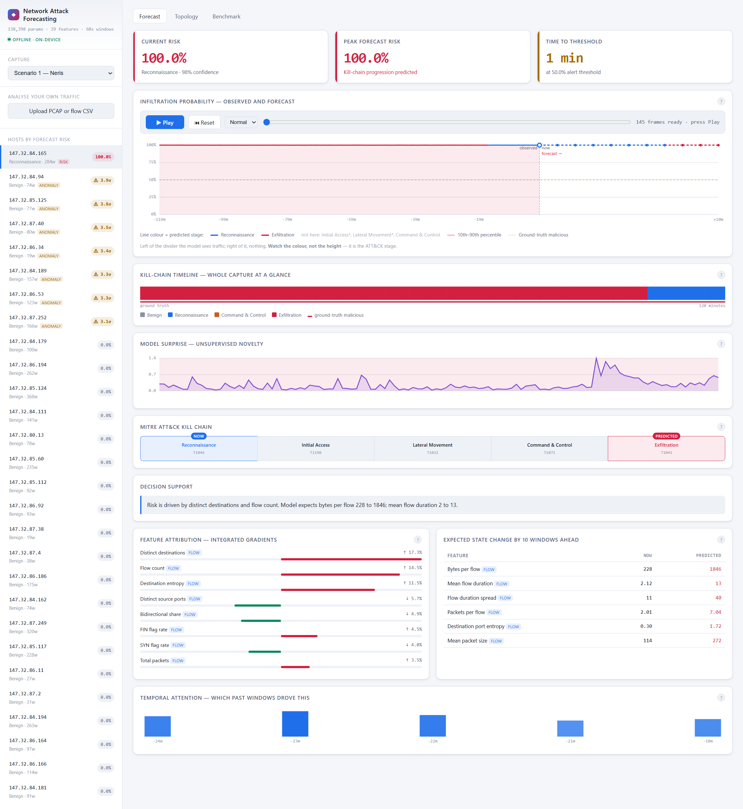
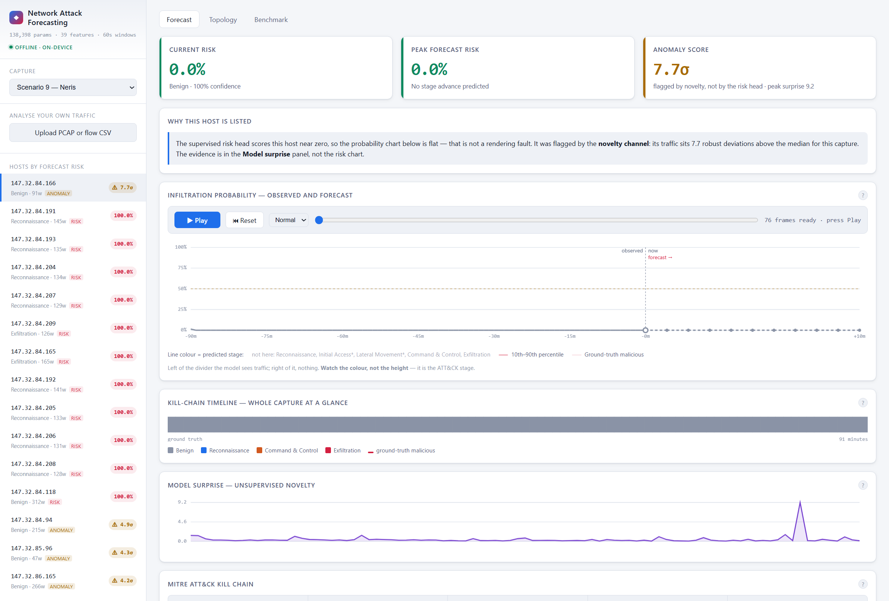
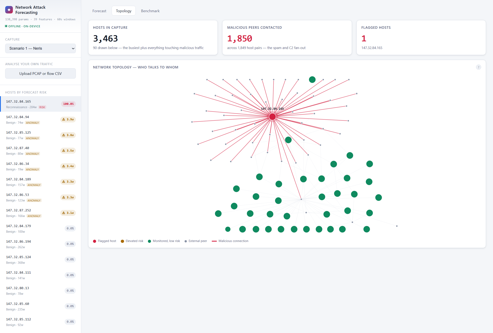
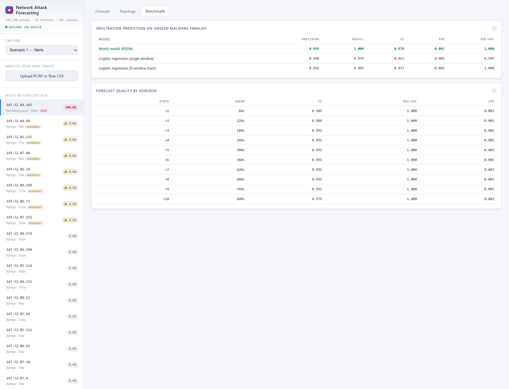

# Demo Guide — SIH 2026, PS 26153

**Team: Git with It** · AI based Network Attack Forecasting from Network Traffic Data

Ye document presentation ke liye hai. Isme teen cheezein hain:

1. **Kya bolna hai** — exact words, panel by panel
2. **Judge kya poochh sakta hai** — har panel se, jawab ke saath
3. **Kya nahi bolna** — jo claims defend nahi kar paoge

---

## 0. Presentation se pehle — checklist

**10 minute pehle:**

```
cd "C:\Users\Admin\Documents\SIH 2026"
.venv\Scripts\python.exe -m uvicorn server.app:app --port 8000
```

Jab ye line dikhe, tabhi aage badho:

```
Uvicorn running on http://127.0.0.1:8000
```

Browser mein kholo: **http://127.0.0.1:8000**

Phir **ye teen cheezein pehle se load kar lo** (pehla load slow hota hai, baad mein cached):

| Kya | Kaise | Kitna time |
|---|---|---|
| Scenario 9 | dropdown se select | ~60 sec |
| Scenario 1 | dropdown se select | ~40 sec |
| Topology tab | tab pe click | ~15 sec |
| Benchmark tab | tab pe click | instant |

Aakhir mein **Scenario 1 pe wapas aa jao**. Ab sab cached hai, har click 1 second.

> **PowerShell window band mat karna.** Server usi mein chal raha hai. Minimize kar sakte ho.

**Backup:** agar laptop pe kuch bhi kharab ho jaye —
`https://network-attack-forecasting.onrender.com` (par pehla load ~3 min, isliye sirf emergency).

---

## 1. Opening — 45 second

Ye sabse important 45 second hain. Yahi tumhe baaki teams se alag karta hai.

> "Aaj ke IDS tools ek connection dekhte hain aur bolte hain — safe ya khatarnak.
> Par attack ek connection nahi hota. Attack ek **process** hota hai: pehle
> scanning, phir andar ghusna, phir apne server ko call karna, phir data
> nikalna.
>
> Ek-ek connection dekhna aisa hai jaise poori film ko ek frame se judge karna.
>
> Humne **world model** banaya hai. Ye traffic classify nahi karta — ye seekhta
> hai ki **network ki state kaise badalti hai**, aur phir us model ko aage chala
> ke batata hai ki host kahan ja raha hai."

**Agar ek line mein bolna ho:**

> "Thermometer batata hai abhi kitna garam hai. Weather model batata hai teen
> ghante mein baarish hogi. Baaki tools thermometer hain — hum weather model hain."

---

## 2. Dashboard — panel by panel



### 2.1 Host list (baayein taraf)

**Bolna:**

> "Har host risk ke hisaab se ranked hai. Sabse upar `147.32.84.165` — 100%.
> Ye is capture ka wahi machine hai jisme asli malware chal raha tha. Baaki
> poora network neeche 0% pe hai."

**Judge poochh sakta hai:**

| Sawal | Jawab |
|---|---|
| *"Sirf ek host red kyun? Baaki sab 0?"* | "Is capture mein sach mein ek hi infected machine hai. Scenario 9 dikhata hu — usme das infected hosts hain, aur wahan das ke das flag hote hain." **(phir Scenario 9 khol do)** |
| *"`RISK` aur `ANOMALY` badge mein kya farak hai?"* | "Do alag detectors hain. `RISK` matlab supervised model confident hai. `ANOMALY` matlab wo host baaki network se alag behave kar raha hai. Dono alag cases mein kaam karte hain — aage dikhata hu." |
| *"`284w` kya hai?"* | "284 windows — matlab us host ka 284 minute ka data hai. Hum har minute ko ek state maante hain." |

### 2.2 Teen top tiles

**Bolna:**

> "Current risk 100%. Peak forecast risk 100%. Aur time to threshold — 1 minute."

**Judge poochh sakta hai:**

| Sawal | Jawab |
|---|---|
| *"100% confidence? Ye overconfident nahi hai?"* | "Haan, aur wajah dataset hai. CTU-13 mein koi host aadha-infected hai hi nahi — 2,58,229 windows mein infected hosts ka ek bhi clean window nahi. Training data perfectly separable tha, to probabilities **calibrated nahi hain** — wo effectively binary decision hai. Decision sahi hai (F1 0.979, FPR 0.0009), par 0 aur 1 ke beech ka number information nahi rakhta. Isiliye humne binary detection ko main task nahi banaya, kill-chain progression banaya." |
| *"Kya koi host beech wale score pe hai — 40%, 60%?"* | "Nahi, ek bhi nahi. Har host ya ~100% hai ya <5%. Ye humne check kiya hai, aur ye upar wali hi baat hai — dataset mein beech ka case maujood hi nahi." |
| *"Time to threshold ka matlab?"* | "Kitne minute baad model ko lagta hai risk 50% cross kar jaayega. Analyst ke liye ye 'kitna time hai' wala number hai." |
| *"Kill chain peechhe kyun jaa raha hai?"* | "Model ka apna forecast hai — wo predict kar raha hai ki agle 10 minute mein host Exfiltration se wapas Reconnaissance jaisi activity pe aa jaayega. Ye galat bhi ho sakta hai, aur isliye humne usko laal nahi, amber rakha hai — de-escalation ko escalation jaisa dikhana galat hota." |

### 2.3 Forecast chart — **yahan rukna, ye core hai**

**Bolna (Play dabane se pehle):**

> "Is divider ke **baayein** model asli traffic dekh raha hai. **Daayein** wo
> kuch nahi dekhta — har point wo khud bana raha hai, learned prior se roll
> forward karke."

**Ab Play dabao.**

> "Ab dekho. Har minute pe model ek forecast banata hai, phir waqt aage badhta
> hai aur pata chalta hai ki wo sahi tha ya nahi."

**Play ke dauraan kya point karna** (teen cheezein hilti hain — inhi pe ungli
rakhna, warna judge ko lagega bas timer chal raha hai):

1. **Playhead** — "now" wala divider baayein se daayein safar karta hai. Uske
   aage ki **halki line** wo waqt hai jo model ne abhi dekha hi nahi.
2. **Neeche kill chain** — NOW aur PREDICTED card badalte hain jaise stage
   badalta hai. Ye sabse dikhne wali cheez hai, judge ka dhyaan idhar le jaana.
3. **Model surprise chart** — usme bhi ek playhead saath-saath chalta hai, aur
   clock mein surprise ka number badalta rehta hai.

> **Timing:** Normal speed pe poora capture ~1 minute leta hai. Agar time kam ho
> to dropdown se **Fast** chuno (~20 second), ya 15 second chalne dene ke baad
> Pause dabakar baat aage badhao — poora chalana zaroori nahi hai.

**Agar kill chain amber ho jaaye** ("step back to Reconnaissance"): ye bug nahi
hai, model sach mein neeche wala stage predict kar raha hai. Isliye wo laal ke
bajaye amber hai — escalation aur de-escalation ek jaise nahi dikhne chahiye.

**Ek baat pehle se bol dena (warna judge poochhega):**

> "Probability 100% pe flat hai — kyunki is dataset mein infected machine har
> window mein active hai. Jo **badal raha hai wo line ka rang hai** — wo ATT&CK
> stage hai."

**Judge poochh sakta hai:**

| Sawal | Jawab |
|---|---|
| *"Line flat hai, kuch ho hi nahi raha?"* | "Probability flat hai kyunki host poore time infected hai. Rang badalta hai — neela Reconnaissance, laal Exfiltration. Wahi progression hai." |
| *"Ye sach mein forecast hai ya bas lookahead?"* | "Sach mein forecast hai, aur ye testable hai. Humare test suite mein assert hai ki imagination-only loss se encoder ko **zero gradient** milta hai. Agar model chupke se aage ka traffic dekh raha hota, wo test fail hota." |
| *"32 rollouts kyun?"* | "Har rollout prior se ek sample hai. 32 chalake percentile band nikalte hain — usse pata chalta hai model kitna sure hai. Band chauda = kam confident." |

### 2.4 Kill-chain timeline

**Bolna:**

> "Ye poora capture ek line mein — har block ek minute, rang us minute ka stage.
> Neeche laal ticks dataset ke apne labels hain, to prediction aur reality ek hi
> axis pe hain."

**Judge poochh sakta hai:**

| Sawal | Jawab |
|---|---|
| *"Sirf 3 stage kyun dikh rahe hain, 5 nahi?"* | "Kyunki CTU-13 mein wo hain hi nahi. Poore 13 captures mein Initial Access ke 27 aur Lateral Movement ke 37 windows hain — aur split ke baad **training set ko 1 aur 0 milte hain**. Lateral Movement training mein ek baar bhi nahi aata, to model use emit kar hi nahi sakta. Isliye humne dashboard pe hi likh diya ki wo unsupported hain." |
| *"Stage labels kahan se aaye? Dataset mein to MITRE nahi hai."* | "CTU-13 ke labels sirf botnet/normal nahi hain — usme detail hai. `CC16` matlab command-and-control channel, `SPAM`, `Binary-Download`. Humne unhi annotations se stages nikale, apne guess se nahi. Table `src/mitre.py` mein ek jagah hai." |

### 2.5 Model surprise

**Bolna:**

> "Ye bina kisi label ke chalta hai. Model har minute predict karta hai ki agla
> minute kaisa hoga, aur ye graph batata hai wo kitna galat tha."

**Judge poochh sakta hai:**

| Sawal | Jawab |
|---|---|
| *"Malware ka surprise kam kyun hai? Ulta nahi hona chahiye?"* | "Yahi humari ek finding hai. Bot machine hai — regular interval pe wahi kaam karta hai, to predictable hai. Insaan random hote hain. Measured: benign 0.44, malicious 0.27, ROC-AUC 0.21. Signal useful hai, bas **ulta padhna** padta hai." |

### 2.6 Explainability panels

**Bolna:**

> "Model sirf score nahi deta, wajah bhi deta hai. Flow count 21%, distinct
> destinations 14.5%. Aur ye table batata hai ki traffic mein kya badlega —
> 'mean flow duration 2 se 9'. Analyst iske upar action le sakta hai."

**Judge poochh sakta hai:**

| Sawal | Jawab |
|---|---|
| *"Ye percentages kaise nikale?"* | "Integrated gradients se. Baseline se asli input tak thoda-thoda karke jaate hain aur dekhte hain score kaise badalta hai." |
| *"SHAP kyun nahi?"* | "SHAP ko hazaar forward passes chahiye, ye interactive dashboard mein nahi chalta. Integrated gradients 32 backward passes mein ho jaata hai. SHAP humne offline cross-check ke liye rakha hai — `src/explain.py` mein hai." |
| *"Pehle kya use kar rahe the?"* | "Plain gradient × input. Wo confident predictions pe toot jaata tha — gradient 1e-3 pe collapse ho jaata aur har feature barabar lagta. Isliye badla." |

#### Temporal attention panel (sabse neeche)

Ye panel batata hai ki model ne **kaunse purane minute** dekhe. Bas ye teen line
bolni hai:

> "Model ke paas 120 minute ka past tha. Agar wo sab pe barabar dhyaan deta to
> har minute ko 0.8% milta. Lekin usne **25% attention sirf 5 minute pe** daala —
> aur sabse zyada 23 minute pehle wale pe, jo average se **7.7 guna** hai.
>
> Matlab model sirf pichhla minute nahi dekh raha. Wo timeline mein peechhe
> jaakar wo point uthata hai jahan se ye host badalna shuru hua."

**Judge poochh sakta hai:**

| Sawal | Jawab |
|---|---|
| *"Ye attention asli hai ya baad mein banaya?"* | "Asli hai. Ye wahi causal-attention weights hain jo prediction head ne consume kiye — model ke andar se nikle hain, koi post-hoc approximation nahi." |
| *"7.7x even ka matlab?"* | "Agar model bina soche saare 120 minute ko barabar wajan deta, to har ek ko 0.8% milta. Is minute ko 6.4% mila — yaani 7.7 guna zyada. Number khud panel pe likha hai." |
| *"Sirf 25% hi? Baaki 75% kahan gaya?"* | "Baaki 115 minute mein bikhra hua hai. Hum keval top 5 dikha rahe hai — 120 bars dikhane ka koi fayda nahi tha." |

---

## 3. Scenario 9 — **do channels wala moment**

Dropdown se **Scenario 9** chuno. (Ya direct: `http://127.0.0.1:8000/?scenario=9`)



**Bolna:**

> "Yahan das infected hosts hain. Dekho — kuch `RISK` se flag hue hain, 100% pe.
> Aur kuch `ANOMALY` se, jinka risk 0% hai.
>
> Ye do alag detectors hain, aur **ulte cases mein fail hote hain.**
>
> Supervised head ko lambi sustained activity chahiye. Jo host sirf 20 minute
> active tha, usse wo nahi dikhta. Par model ka apna prediction error usse pakad
> leta hai — kyunki chhota naya burst unexpected hota hai.
>
> Isliye hum dono pe flag karte hain. Poore dataset pe: **30 mein se 28 hosts
> pakde, 4.9% false alarms.** Unme se 10 sirf anomaly channel se pakde gaye."

**Ab upar wale anomaly host pe click karo** — teesra tile `7.7σ` dikhayega aur ek panel batayega ki kaunsa channel fire hua.

**Judge poochh sakta hai:**

| Sawal | Jawab |
|---|---|
| *"Anomaly wale hosts benign hain, ye false positives hain?"* | "Haan, kuch hain. Anomaly channel ka kaam hi ye hai ki jo alag lage wo dikha de. 4.9% false alarm rate hai. Trade-off ye hai — itna dekar hum wo 10 hosts pakad lete hain jo pehla channel poori tarah miss karta." |
| *"Dono ko mila ke ek score kyun nahi banate?"* | "Kyunki dono ka confidence alag hai. `RISK` matlab model confident hai, `ANOMALY` matlab 'dekh lo'. Analyst ko dikhna chahiye kaunsa fira. Blend karne se wo information chali jaati." |
| *"σ ka matlab?"* | "Us capture ke median se kitne robust deviations upar hai. Median aur MAD use karte hain, mean-SD nahi — kyunki jo outlier hosts hum dhundh rahe hain wahi SD ko phula dete." |

---

## 4. Topology tab



**Bolna:**

> "Ye network ka naksha hai. Laal node compromised host hai, laal lines uski
> malicious connections. Capture mein 3,463 hosts hain, aur bot ne **1,850**
> se baat ki — wo spam fan-out hai."

**Judge poochh sakta hai:**

| Sawal | Jawab |
|---|---|
| *"Sirf 90 nodes kyun draw kiye?"* | "1,850 peers draw karne pe unreadable hairball banta hai, aur layout O(n²) hai to browser hang ho jaata. Priority se chunte hain — pehle flagged hosts, phir busiest malicious peers. Poora number stat card mein dikha dete hain." |
| *"Ye graph model use karta hai?"* | "Nahi, ye visualisation hai. Node ka rang usi model ka risk score hai jo Forecast tab use karta hai. State cells jaan-boojh ke aggregate hain — model ko behaviour seekhna chahiye, IP addresses yaad nahi karne chahiye." |

---

## 5. Benchmark tab — **numbers wala moment**



**Bolna — aur yahan honest rehna:**

> "Detection pe hum logistic regression ke **barabar** hain — 0.979 vs 0.977.
> Aur ye jaan-boojh ke bata raha hu.
>
> Pehle humare paas 7 captures the aur ye gap 0.984 vs 0.744 tha. Jab saare 13
> add kiye, gap **gaayab ho gaya** — kyunki wo purana test split degenerate tha,
> uske saare positives ek hi host se the.
>
> Farak kahan hai? **Forecasting mein.** Agle 3 minute ka stage predict karne
> mein hum 0.647 dete hain, 'maan lo kuch nahi badlega' wala baseline 0.478.
> 10 mein se 9 horizons pe hum aage hain.
>
> *(Chart pe cursor ghumao)* Har point pe exact numbers aa jaate hain — kitne
> minute aage, humara kya, baseline ka kya, aur gap kitna."
>
> Aur ye naye malware pe bhi transfer karta hai — Neris aur Rbot pe train kiya,
> **Virut aur Murlo pe test**, F1 0.874."

**Judge poochh sakta hai:**

| Sawal | Jawab |
|---|---|
| *"To tumhara model baseline se behtar nahi hai?"* | "Detection mein nahi. Aur wahi honest baat hai. Par PS detection nahi maangta — wo **forecasting aur progression** maangta hai. Wahan hum clearly aage hain." |
| *"Baseline ko kam data diya kya?"* | "Nahi. Bilkul wahi features, wahi scaler, wahi labels. Stacked wale baseline ko to wahi 8-window history bhi di jo humare model ko milti hai." |
| *"Threshold kaise chuna?"* | "Validation split pe, aur test chhune se pehle freeze kar diya. Test pe tune karte to har number badh jaata." |
| *"+1 window pe to dono barabar hain"* | "Haan, wahan gap 0.0003 hai — tie hai, aur tooltip khud 'level' likhta hai. 1 minute aage stage badalta hi nahi, to 'kuch nahi badlega' maanna sahi jawab hai. Model ka fayda **3 se 7 windows** pe dikhta hai, jahan actually stage shift hota hai — wahan gap 0.17 tak jaata hai." |
| *"Persistence baseline kya hai?"* | "'Maan lo stage nahi badlega.' Ye forecasting mein sabse imandaar baseline hai — agar usse nahi jeet paate to model ne dynamics seekhi hi nahi. Do variants hain, ek ko ground truth deke (oracle) aur ek ko model ka apna estimate deke (fair)." |

---

## 6. Upload PCAP (agar time bacha ho)

File: `data\raw\neris-botnet.pcap` (56 MB) · lagega ~24 second

**Bolna:**

> "Ye raw PCAP hai — packets, flows nahi. System pehle **raw packets se flows
> reconstruct karta hai** — wahi kaam jo Argus ya nfdump karte hain — phir dono
> feature levels nikalta hai: TTL variance, TCP window size, retransmissions.
> 18,000 flows, 24 second, aur infected host pakad liya."

**Judge poochh sakta hai:**

| Sawal | Jawab |
|---|---|
| *"Sirf CTU-13 pe chalta hai?"* | "Nahi. Ye upload isi ka proof hai — koi bhi PCAP ya NetFlow export daal sakte ho." |

> **Time kam ho to ye segment skip kar dena.** Forecast panel aur explainability
> zyada important hain.

---

## 7. Findings — agar judge deep jaaye

Ye teen cheezein tumhari sabse badi taakat hain, kyunki inme tumne **apne hi
kaam ki galti pakdi**.

### Finding 1 — Label leak

> "Humne apne hi pipeline mein cheating pakdi. Jo PCAP humne download ki usme
> sirf infected host ka traffic tha, to 'packet data available' flag seedha label
> ban gaya. Model behaviour nahi, metadata seekh raha tha — training windows pe
> 0.9995, usi host ke agle windows pe 0.003, cliff bilkul split boundary pe.
> Hataane ke baad F1 0.23 se 0.98. **Leak model ko behtar nahi, kharab kar raha
> tha.**"

### Finding 2 — Dataset mein pre-infection baseline hai hi nahi

> "2,58,229 windows check kiye. Infected hosts ka **ek bhi clean window nahi**.
> CTU-13 malware chala ke record kiya gaya tha, to 'pehle normal tha phir infect
> hua' wala transition capture hi nahi hua. Isliye humne binary detection ke
> bajaye **kill-chain progression** ko main task banaya."

### Finding 3 — Do channels ulte fail hote hain

> "Ye upar Scenario 9 mein dikhaya. Supervised head sustained activity pe kaam
> karta hai, surprise channel short bursts pe. Dono ulte hain, isliye dono lagaye."

---

## 8. Jo bilkul mat bolna

| ❌ Mat bolna | ✅ Iske bajaye |
|---|---|
| "Ye attack hone se pehle predict karta hai" | "Ye kill-chain progression forecast karta hai" |
| "F1 0.98, hum baseline se bahut aage hain" | "Detection mein barabar, forecasting mein aage" |
| "Ye har malware pe kaam karega" | "Unseen families pe detection transfer hota hai — F1 0.874. Stage forecasting abhi transfer nahi hota." |
| "Binary F1 +10 windows pe 0.99, matlab 10 min pehle predict karte hain" | Ye mat bolna. Target horizon pe barely badalta hai, ye forecasting skill nahi hai. |

---

## 9. Jab jawab na aaye

Seedha bol dena:

> **"Wo implementation detail hai, code mein hai, main dikha sakta hu."**

Phir file khol dena. Ye kamzori nahi lagti — guess karke galat bolne se hazaar
guna behtar hai.

---

## 10. Agar sab bhool jao — chaar line

1. *"Purane tools ek connection dekh ke label dete hain. Humara model seekhta hai ki network kaise badalta hai, phir aage chala ke dekhta hai."*
2. *"Traffic dekhna band karke bhi model aage chal sakta hai — wahi forecast hai."*
3. *"Detection mein hum baseline ke barabar hain. Farak forecasting mein hai — 9 out of 10 horizons."*
4. *"Humne apne pipeline mein ek leak pakda aur hata diya."*

---

## 11. Emergency

| Problem | Kya karo |
|---|---|
| Server band ho gaya | PowerShell mein `Ctrl+C`, phir command dobara chalao |
| Page blank / charts nahi dikh rahe | `Ctrl+Shift+R` (hard refresh) |
| Scenario load slow | Dusre scenario pe switch karo jo already cached hai |
| Laptop hi kharab | `https://network-attack-forecasting.onrender.com` — par pehla load ~3 min |
| Kuch bhi nahi chala | GitHub repo khol ke code aur benchmark.md dikha do — `github.com/HowSuyash/AttackForecast` |

---

## 12. Numbers — ek jagah

| Metric | Value |
|---|---|
| Dataset | CTU-13, saare 13 captures |
| Network states | 2,58,229 |
| Infected hosts | 30 |
| Model size | 138,398 parameters, CPU-only |
| Features | 39 flow + 23 packet |
| Detection F1 (temporal) | **0.979** (baseline 0.977) |
| Stage macro-F1 | **0.537** (baseline 0.453) |
| Stage forecast +3 windows | **0.647** (persistence 0.478) |
| Unseen families (Virut, Murlo) | **F1 0.874**, ROC-AUC 0.982 |
| Triage | **28/30 hosts**, 4.9% false alarms |
| Surprise ROC-AUC | 0.210 (anti-correlated, ulta padho) |
