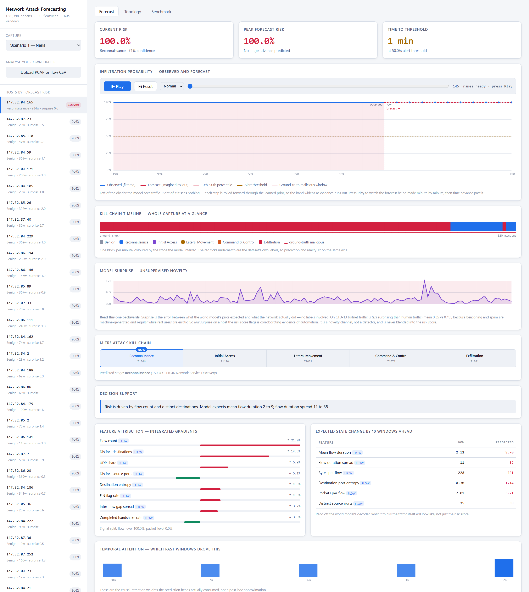
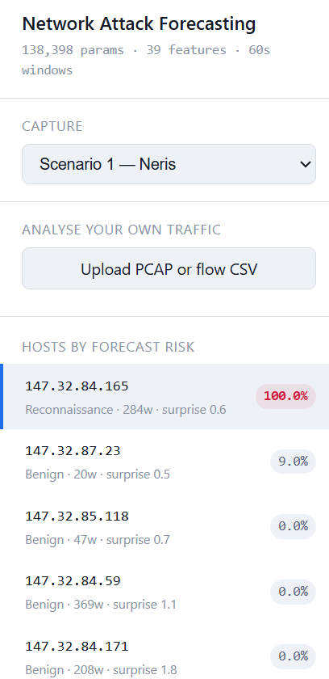
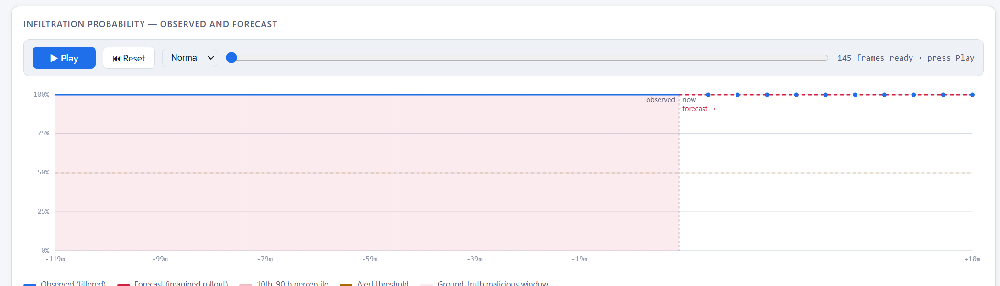
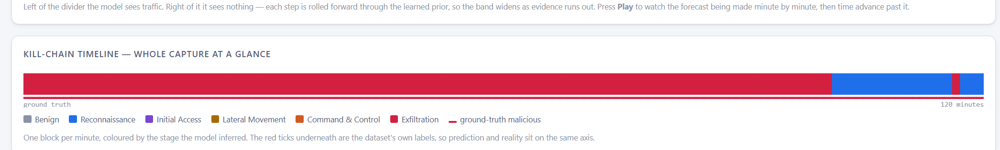
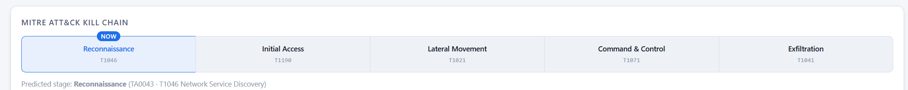
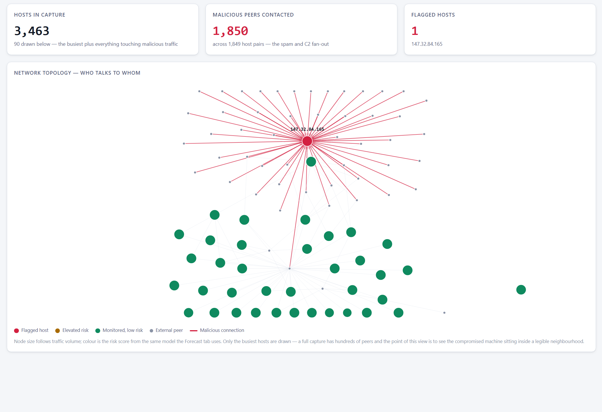
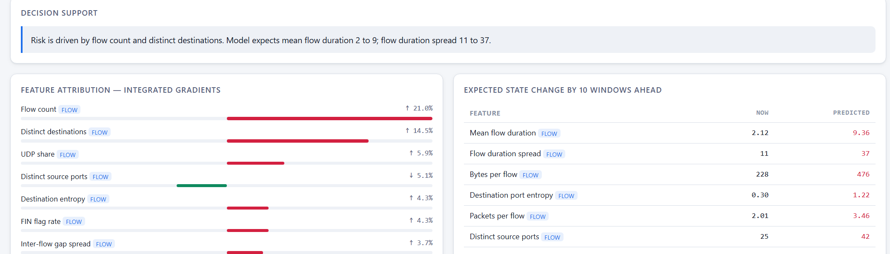

# Tutorial — Poora Project Zero Se

Ye document maan ke chalta hai ki tumhe is project ke baare mein **kuch nahi pata**.
Har term explain kiya gaya hai, har command ka asli output diya gaya hai, aur
har concept ke saath ye bhi likha hai ki wo **kis file mein** hai.

`README.md` judges ke liye technical reference hai. **Ye document tumhare
liye hai** — samajhne ke liye.

---

## Contents

1. [Network traffic hoti kya hai](#1-network-traffic-hoti-kya-hai)
2. [Problem kya hai](#2-problem-kya-hai)
3. [Data kahan se aaya](#3-data-kahan-se-aaya)
4. [Humne kya banaya](#4-humne-kya-banaya--ek-line-mein)
5. [Andar kya hota hai — 4 steps](#5-andar-kya-hota-hai--4-steps)
6. [MITRE ATT&CK stages](#6-mitre-attck-stages)
7. [Explainability](#7-explainability--kyun-bola)
8. [Kaise pata ki kaam karta hai](#8-kaise-pata-ki-kaam-karta-hai)
9. [Teen honest findings](#9-teen-honest-findings)
10. [Khud chala ke dekho](#10-khud-chala-ke-dekho)
11. [Dashboard mein kya-kya hai](#11-dashboard-mein-kya-kya-hai)
12. [File map — kahan kya hai](#12-file-map--kahan-kya-hai)
13. [Cheat sheet](#13-cheat-sheet)

---

## 1. Network traffic hoti kya hai

Jab bhi tumhara computer kisi doosre computer se baat karta hai — YouTube khola,
WhatsApp bheja, app ne update check kiya — ek **connection** banta hai.

Har connection ka record bacha rehta hai, jise **flow** kehte hain. Socho
phone call record:

| Phone call record | Network flow |
|---|---|
| Kisne call kiya | Source IP — `147.32.84.165` |
| Kisko kiya | Destination IP — `74.125.232.195` |
| Kitni der | Duration — `2.3 seconds` |
| Kab | Timestamp |
| — | Kitna data gaya (bytes, packets) |
| — | Kaunse **port** pe (80 = website, 53 = DNS, 25 = email) |

**Port kya hai?** Ek computer pe kai services chal sakti hain. Port number
batata hai ki baat kis service se ho rahi hai — jaise ek building mein flat
number.

Ek normal office network mein **lakhon flows per hour** bante hain. Humare
dataset mein ek capture = **28 lakh flows**, 6 ghante ka.

---

## 2. Problem kya hai

Ek company ke network mein 200 computers hain. Unme se ek **hack ho chuka hai**.
Security team ko pata karna hai: **kaunsa?**

**Purana tareeka:** ek tool har flow dekhta hai aur bolta hai "safe" ya
"khatarnak".

**Iski problem:** attack ek flow nahi hota. Attack ek **process** hota hai jo
waqt ke saath unfold hota hai:

```
Step 1: Scan          "kaunse ports khule hain?"
Step 2: Andar ghusna   weak point exploit karo
Step 3: Phone home     "main andar hu, order do"
Step 4: Failna         doosre computers pe
Step 5: Data churana   bahar bhejna
```

Ek-ek flow dekhna aisa hai jaise **poori film ko ek frame se judge karna**.
Har frame akela normal lag sakta hai; sequence batati hai ki kahani kya hai.

Aur asli dikkat: purana tool tab batata hai jab **nuksaan ho chuka** hota hai.

> NTRO ka problem statement yahi maangta hai —
> *"predict the likelihood and progression of malicious activity **before
> compromise is completed**"*

---

## 3. Data kahan se aaya

**CTU-13** — Czech Technical University ne 2011 mein banaya. Unhone:

1. Asli computers liye
2. Unme **asli malware** daala — Neris, Rbot, Virut (ye asli botnets hain)
3. 6 se 66 ghante tak **saara network traffic record** kiya
4. Har flow pe label lagaya — normal hai ya malware ka

**Botnet kya hai?** Malware jo tumhare PC ko *remote-controlled zombie* bana
deta hai. Wo attacker ke server ko call karta hai ("order do"), phir kaam karta
hai — spam bhejta hai, fake ad clicks karta hai.

Ye data free aur legal hai (CC BY licence), aur PS mein naam se mention hai.

Humne **7 captures** use kiye → **95,518 network states** bane.

Download karne ka command [section 10](#10-khud-chala-ke-dekho) mein hai.

---

## 4. Humne kya banaya — ek line mein

> **Network ka chhota simulator, jo seekhta hai ki traffic kaise badalta hai,
> aur usse aage chala ke batata hai ki aage kya hone wala hai.**

Weather wali misaal se samjho:

| Thermometer | Weather forecast model |
|---|---|
| "abhi 35°C hai" | "3 ghante mein baarish hogi" |
| Sirf **abhi** batata hai | Seekhta hai ki **mausam kaise badalta hai**, phir aage chalata hai |
| = purana IDS | = **humara world model** |

**"World model"** ka matlab yahi hai — AI jo duniya ka *internal simulation*
banata hai. PS mein exactly yahi maanga gaya hai.

---

## 5. Andar kya hota hai — 4 steps

### Step 1 — Traffic ko chunks mein todo

Lakhon flows seedha model mein nahi daal sakte. Isliye **1-minute ke tukde**
karte hain.

Har minute mein, har computer ka ek **summary** banate hain — **39 numbers**:

| Number | Kya batata hai |
|---|---|
| `n_flows` | Kitne connections banaye |
| `n_unique_dst` | Kitne alag computers se baat ki |
| `n_unique_dport` | Kitne alag ports try kiye |
| `frac_syn_only` | Kitne connections ka **jawab hi nahi aaya** ← scanning ki nishani |
| `egress_ratio` | Data zyada bahar gaya ya andar aaya |
| `beacon_regularity` | Connections regular interval pe the ya random ← robot vs insaan |
| ...aur 33 aur | |

Ye 39 numbers ka set = **ek network state**. Matlab: *"us ek minute mein wo
computer kya kar raha tha."*

> **Asli finding:** benign computers pe `frac_syn_only` ka average **0.04** tha,
> infected pe **0.57**. **13 guna farak.** Malware chupke se scan kar raha tha.

📁 Code: [`src/features/flow.py`](../src/features/flow.py) (flows padhta hai),
[`src/features/windows.py`](../src/features/windows.py) (states banata hai)

### Step 2 — Model transitions seekhta hai

Ab model ko states ki **sequence** dikhate hain:

```
minute 1 → minute 2 → minute 3 → minute 4 → ...
```

Model sirf **ek cheez** seekhta hai:

> "Aise state ke baad, aam taur pe aisa state aata hai."

Bas. Yehi core hai — bilkul jaise weather model seekhta hai "aisa pressure
pattern ho to kal baarish".

📁 Code: [`src/model/world_model.py`](../src/model/world_model.py)

### Step 3 — Ab traffic dikhana band kar do ← **yahi asli trick hai**

Kyunki model ne transition seekh liya hai, wo **khud se agla state bana sakta
hai**. Phir usse agla. Phir usse agla. **10 baar.**

Ye 10 states **kabhi hue hi nahi** — model ne inhe *imagine* kiya hai.

**Yahi forecast hai.** Aur yahi world model ko normal classifier se alag karta hai.

📁 Code: `WorldModel.imagine()` — [`src/model/world_model.py`](../src/model/world_model.py)

### Step 4 — Har imagined state pe sawal poochho

Model ke do "heads" (chhote decision-makers) hain. Har imagined state pe:

1. **"Khatra hai?"** → 0 se 1 ke beech probability
2. **"Kill chain ke kis stage pe hai?"** → 5 stages mein se ek

Kyunki 10 baar imagine karte hain, hume **agle 10 minute ka forecast** milta hai.

Aur ye poora kaam **32 baar** karte hain (har baar thoda alag), taaki pata chale
model kitna sure hai. Isse dashboard pe wo **shaded band** banta hai — band
chauda = model confident nahi.

📁 Code: [`src/inference.py`](../src/inference.py)

---

## 6. MITRE ATT&CK stages

**MITRE** ek American non-profit hai jisne attackers ke behaviour ki **standard
dictionary** banayi. Duniya bhar ki security teams yahi vocabulary use karti hain.

PS ne 5 stages maange:

| Stage | Matlab | Rozmarra ki misaal |
|---|---|---|
| **Reconnaissance** | Dekh raha hai kya khula hai | Chor ghar ke bahar khidkiyan check kar raha |
| **Initial Access** | Andar ghus gaya | Khidki tod ke andar |
| **Lateral Movement** | Network mein fail raha hai | Ek kamre se doosre kamre mein |
| **Command & Control** | Boss server se orders le raha | Chor phone pe gang leader se baat kar raha |
| **Exfiltration** | Data bahar bhej raha hai | Saaman bag mein bhar ke nikaalna |

### Stages nikaale kaise?

Ye achha wala part hai. CTU-13 ke labels sirf "botnet/normal" nahi hain —
usme **detail** hai:

```
flow=From-Botnet-V42-TCP-CC16-HTTP          ← "CC" = Command & Control
flow=From-Botnet-V42-TCP-Attempt-SPAM       ← spam bhejne ki koshish
flow=From-Botnet-V49-...-Binary-Download    ← payload download
flow=From-Botnet-V42-UDP-DNS                ← DNS lookup
```

To humne stages **apne guess se nahi**, **dataset ke apne annotations se**
nikaale. Judges ke saamne ye defend karna bahut aasan hai.

**Asli result** — infected computer ka timeline:

```
1 1 1 1 1 1 1 1 1 5 5 5 5 5 5 5 5 5 5 5 5 5 ...
└── Reconnaissance ──┘└──── Exfiltration ────┘
```

Pehle 9 minute scanning, phir spam bhejna shuru. **Ye asli transition hai** —
aur model ko yahi pehle se predict karna hai.

📁 Code: [`src/mitre.py`](../src/mitre.py) — mapping table `_LABEL_STAGE_RULES` mein hai

---

## 7. Explainability — "kyun bola?"

PS clearly kehta hai: *"Black-box outputs without interpretability are not
acceptable."*

Matlab sirf "khatra 81%" bolna kaafi nahi. **Kyun** batana padega.
Humne 3 tareeke lagaye:

**1. Kaunse numbers ne score badhaya**

Model ko thoda-thoda karke input dete hain aur dekhte hain score kaise badalta
hai. Isse har feature ka **hissa** nikalta hai.

**2. Kaunse purane minute matter kiye**

Model ke andar **attention** hai — wo dekhta hai ki decision lete waqt kis
purane minute pe dhyan diya. Wo weights hum dikhate hain.

**3. Traffic mein kya badlega** ← sabse kaam ka

Model sirf risk score nahi, **agla traffic bhi predict** karta hai. To hum bol
sakte hain:

> "Distinct destination ports 12 se 240 ho jaayenge"

Ye ek analyst ke liye "risk 0.81" se hazaar guna zyada useful hai — kyunki uske
upar **action** liya ja sakta hai.

📁 Code: [`src/explain.py`](../src/explain.py)

---

## 8. Kaise pata ki kaam karta hai

### Cheating kaise roki

Agar model ko wahi data test mein do jo training mein diya tha, wo **ratt ke**
100% score le lega. Isliye:

**Time se split kiya.** Har capture ka:

```
|<--------- pehla 70% --------->|<- 15% ->|<- aakhri 15% ->|
         TRAINING                  VAL          TEST
```

Model ne test wala time **kabhi dekha hi nahi**. Ye asli deployment jaisa hai —
aaj ka data seekho, kal ka predict karo.

Beech mein ek **guard band** bhi rakha hai taaki koi sequence boundary cross na
kare.

### Comparison — baselines

Sirf "hamara model achha hai" bolna bekaar hai. **Kiske comparison mein?**

Humne ek purana simple tareeka (**logistic regression**) banaya aur usse
**bilkul wahi data, wahi features** diye. Fair fight.

| Model | F1 | Galat alarm rate (FPR) |
|---|---|---|
| **Humara world model** | **0.984** | **0.000** |
| Purana tareeka (8 min history) | 0.744 | 0.004 |
| Purana tareeka (1 min) | 0.550 | 0.009 |

**F1 kya hai?** 0 se 1 ke beech score, jo do cheezein milata hai:

- **Precision** — jab alarm bajaya, kitni baar sach mein attack tha
- **Recall** — jitne asli attacks the, unme se kitne pakde

0.984 matlab dono lagbhag perfect. Aur **FPR 0.000** = ek bhi galat alarm nahi.
SOC team ke liye ye critical hai — jhoothe alarms se log tool hi band kar dete hain.

📁 Code: [`src/evaluate.py`](../src/evaluate.py) · Result:
[`artifacts/reports/benchmark.md`](../artifacts/reports/benchmark.md)

---

## 9. Teen honest findings

### Finding 1 — Humne apne hi code mein cheating pakdi

Jo PCAP file humne download ki, usme **sirf infected computer ka traffic** tha.
Model ke liye shortcut ban gaya:

> "Agar packet data available hai → ye infected hai"

Model ne behaviour seekhna chhod ke **ye shortcut ratt liya**. Proof:

| | Training ke windows | Baad wale windows |
|---|---|---|
| Model ka score | **0.9995** | **0.003** |

Cliff bilkul us line pe tha jahan training khatam hoti hai — matlab kuch seekha
hi nahi tha.

Shortcut hataya → **F1 0.23 se 0.98**. Leak model ko *behtar* nahi, **kharab**
kar raha tha.

> Presentation slide 4 pe ye sabse upar hai. **Apne hi kaam mein bug pakadna
> kisi bhi metric se strong signal hai** — zyadatar teams ye kar hi nahi paatin.

### Finding 2 — Dataset mein "attack se pehle" ka data hai hi nahi

Humne check kiya: **856 malicious windows, aur infected computers ka ek bhi
clean window nahi.**

Kyun? Researchers ne malware chala ke recording start ki. To "pehle normal tha,
phir infected hua" wala transition **capture hi nahi hua**.

Isliye humne **kill-chain progression** ko main task banaya — usme 138 asli
transitions hain.

### Finding 3 — Ek signal ulta nikla

Humne socha tha: jo traffic model ko **anokha** lage, wo attack hoga. Ulta nikla:

| | Average "surprise" |
|---|---|
| Normal traffic | 0.49 |
| Malware traffic | **0.35** |

Malware ka traffic normal se **kam** anokha hai. Logic: **bot machine hai** —
regular interval pe kaam karta hai. Insaan random hote hain.

Signal useful hai, bas **ulta padhna** padta hai. Dashboard pe wahi likha hai.

---

## 10. Khud chala ke dekho

### Setup (ek baar)

```bash
cd "C:\Users\Admin\Documents\SIH 2026"
python -m venv .venv
.venv\Scripts\python.exe -m pip install -r requirements.txt
```

### Step A — Data download

```bash
curl -L -o data/raw/CTU-13-Dataset.tar.bz2 ^
  https://mcfp.felk.cvut.cz/publicDatasets/CTU-13-Dataset/CTU-13-Dataset.tar.bz2
tar -xjf data/raw/CTU-13-Dataset.tar.bz2 -C data/raw
```

~1.9 GB. Ho chuka hai to skip karo.

### Step B — Traffic ko states mein badlo

```bash
.venv\Scripts\python.exe -m src.prepare_data
```

**Asli output:**

```
reading capture20110810.binetflow
capture20110810.binetflow: 2824636 flows, 1.5% botnet, span 367.2 min
state cells: 21866 over 275 hosts, 1.30% malicious
stages: 284/284 malicious cells from dataset labels, 0 from behaviour
forecast targets: 1.29% of cells precede an infiltration within 5 windows
scenario 1 done in 75.6s
```

**Padho kaise:** 28 lakh flows → 21,866 states, 275 computers, 367 minute ka
data. Saare 284 malicious states ke stages **dataset ke labels se** aaye
(humare guess se nahi).

### Step C — Model train karo

```bash
.venv\Scripts\python.exe -m src.train
```

**Asli output:**

```
temporal split: train 61522 / val 8876 / test 14776 cells
sequences: 12955 of length 16 over 571 hosts, 2.36% positive steps
world model: 138,398 parameters
epoch  1/40 (169s) train loss 10.2502 | val AP 0.3373 stage-F1 0.3520
epoch 12/40 (14s)  train loss  2.9982 | val AP 1.0000 stage-F1 0.5469
  -> new best, saved world_model.pt
done. best epoch 12
```

**Padho kaise:** loss neeche jaana chahiye (10.2 → 2.9 ✓), val score upar
(0.33 → 1.00 ✓). Epoch 12 sabse achha tha, wahi save hua.

### Step D — Benchmark chalao

```bash
.venv\Scripts\python.exe -m src.evaluate
```

Result yahan aata hai: `artifacts/reports/benchmark.md`

### Step E — Tests

```bash
.venv\Scripts\python.exe -m tests.smoke_model
.venv\Scripts\python.exe -m tests.test_packet
```

**Asli output:**

```
parameters: 141,365
observe: shapes OK
imagine: shapes OK
imagine: no encoder dependency OK     ← ye sabse important line hai
attention: causal mask OK
all smoke checks passed
```

> **"no encoder dependency OK"** ka matlab: test ne verify kiya ki jab model
> imagine karta hai, tab wo **asli traffic ko chhoo bhi nahi raha**. Agar wo
> chupke se dekh raha hota, ye test fail ho jaata. **Ye tumhara proof hai ki
> forecast asli hai.**

### Step F — Dashboard

```bash
.venv\Scripts\python.exe -m uvicorn server.app:app --port 8000
```

Browser: `http://127.0.0.1:8000`

Pehli baar scenario load hone mein ~50 second (saare hosts rank karta hai),
uske baad har click **1 second**. Demo se pehle ek baar load kar lena.

---

## 11. Dashboard mein kya-kya hai



### Left side — hosts ki list



Saare computers **risk ke hisaab se sorted**. Sabse upar `147.32.84.165` —
**100.0%**. Neeche waale sab **0.0%**.

Yehi wo computer hai jisme is capture mein asli malware tha. Model ne **sahi
pakda**.

### Beech mein — forecast chart + REPLAY (**ye sabse important hai**)



- **Baayein** divider ke — model asli traffic dekh raha hai (neeli line)
- **Daayein** divider ke — model **kuch nahi dekh raha**. Har point wo khud se
  bana raha hai (laal dotted line)
- **Shaded band** — 32 alag-alag rollouts ka spread. Chauda = model kam sure
- **Gulabi background** — jahan sach mein attack tha (ground truth)

**▶ Play dabao.** Capture minute-by-minute chalega — har minute pe model ek
forecast banata hai, phir waqt aage badhta hai aur pata chalta hai ki wo sahi
tha ya nahi.

> Demo mein **yahi tumhara sabse strong moment hai**. Play dabao, phir kahо:
> *"is line ke daayein model ko traffic dikh hi nahi raha — wo imagine kar raha
> hai. Ab dekho waqt aage badhta hai aur pata chalta hai ki wo sahi tha."*
>
> Static chart mein tum ye **batate** ho. Replay mein wo **dikh jaata** hai.

Slider se kisi bhi minute pe ja sakte ho, aur speed Slow/Normal/Fast chun sakte ho.

Technically: saare frames server pe **ek batched pass** mein bante hain
(145 frames ≈ 2 second), har frame pe alag model call nahi hoti.

### Kill-chain timeline — poora capture ek nazar mein



Har minute ka ek block, uske stage ke rang mein. **Neela = Reconnaissance,
laal = Exfiltration.** Neeche laal ticks dataset ke apne labels hain.

Yahi wo `111111111555555...` sequence hai jo section 6 mein thi — ab aankhon se
dikhti hai. Replay chalte waqt jo hissa "dekha ja chuka" hai wo solid rehta hai,
baaki halka pad jaata hai, aur ek cursor line position dikhati hai.

### MITRE kill chain



5 stages, aur jahan host abhi hai wahan **NOW** ka badge. Agar model aage badhne
ka predict kare to wo stage bhi highlight hoti hai.

### Topology tab — network ka naksha



Upar **Topology** tab pe click karo.

- **Laal node** — flagged host (`147.32.84.165`)
- **Laal lines** — malicious connections
- **Hare nodes** — monitored hosts, low risk
- **Chhote grey** — external peers
- Node ka size traffic volume se

Jo laal **starburst** dikh raha hai — wo bot ka spam fan-out hai. Stats batate
hain: capture mein **3,463 hosts**, aur bot ne **1,850 malicious peers** se
baat ki.

> Ye slide-worthy image hai. Judge ko ek nazar mein samajh aa jaata hai ki
> problem kya hai — bina kisi explanation ke.

### Explainability panels



- **Decision support** — ek line mein plain English wajah
- **Feature attribution** — kis number ne kitna contribute kiya (`Flow count 21.0%`)
- **Expected state change** — traffic mein kya badlega (`2.12 → 9.36`)

### Upload PCAP button

Apna koi bhi capture daal sakte ho. Wo raw packets se flows reconstruct karega
aur wahi forecast chalayega. Test kiya hua hai: 4 lakh packets → 18,271 flows →
**12 second**.

### Benchmark tab

Upar `Benchmark` pe click karo — comparison table wahan hai.

---

### Replay andar se kaise kaam karta hai

Ye samajhna zaroori hai kyunki judge poochh sakta hai *"har frame pe model
chalate ho? itna fast kaise?"*

**Naive tareeka:** 145 minutes = 145 API calls = 145 model runs. Bahut slow.

**Humara tareeka:** `observe()` ek baar chalao — wo **saare timesteps ke latent
states** ek saath deta hai. Phir har timestep se rollout ko **ek batch** mein
chala do:

```
observe(poora sequence)  ──▶  h[0..T], z[0..T]      ek call
                                    │
imagine(h[15..T], z[15..T])  ──▶  saare forecasts   ek batched call
```

Isliye 145 frames **2 second** mein ban jaate hain — 145 alag calls ke bajaye
do calls.

Har frame ka attention history uske pehle ke **16 windows** hai (fixed length),
taaki batch rectangular rahe — aur yahi length model ne training mein dekhi thi.

📁 Code: `ForecastEngine.replay()` — [`src/inference.py`](../src/inference.py)

### Topology andar se kaise banta hai

State cells jaan-boojh kar har host ka traffic **aggregate** kar dete hain —
model ko behaviour seekhna chahiye, IP addresses yaad nahi karne chahiye. Lekin
isse ye pata nahi chalta ki kaun kisse baat kar raha tha.

Isliye topology ke liye ek **alag table** banti hai: `(src, dst)` pairs ke saath
flow counts aur malicious flag. Wo `scenario_XX_edges.parquet` mein save hoti hai.

Ek design decision jo poochha ja sakta hai: **graph mein sirf 90 nodes kyun?**
Kyunki bot ne 1,850 peers se baat ki — saare draw karne pe ek unreadable
hairball banta hai (aur browser hang ho jaata hai, layout O(n²) hai). To hum
priority se chunte hain: pehle flagged hosts, phir busiest malicious peers, phir
volume se baaki. Aur **poora number stat card mein dikha dete hain** — wo waise
bhi graph se zyada strong statement hai.

📁 Code: `build_edges()` — [`src/features/windows.py`](../src/features/windows.py),
`/api/graph` — [`server/app.py`](../server/app.py)

---

## 12. File map — kahan kya hai

```
src/
  config.py          saari settings ek jagah (window size, model size...)
  mitre.py           5 stages + CTU-13 labels se stage nikalne ka table
  features/
    flow.py          .binetflow file padhta hai, TCP flags nikalta hai
    packet.py        PCAP se packet-level features; PCAP se flows bhi banata hai
    windows.py       1-minute states banata hai  ← "39 numbers" yahan bante hain
                     build_edges() ← topology ka (src,dst) table
  dataset.py         states ko sequences mein todta hai, scaling
  model/
    world_model.py   THE MODEL — encoder, GRU, prior/posterior, heads
    baseline.py      comparison ke liye purana tareeka
  train.py           training loop
  evaluate.py        benchmark
  explain.py         3 explanation channels
  inference.py       forecast engine (dashboard isi ko call karta hai)
                     analyse() ← ek forecast | replay() ← saare frames
                     rank_hosts() ← saare hosts ek batch mein

server/
  app.py             API
  static/index.html  dashboard (poora ek file mein, offline chalta hai)

tests/
  smoke_model.py     model sahi hai ya nahi
  test_packet.py     PCAP parsing sahi hai ya nahi

docs/
  TUTORIAL.md        ye file
  architecture.md    2-page technical doc (deliverable)
  presentation.md    5-slide outline
  demo-script.md     2-min video ka script
  make_ppt.py        PPT generate karta hai
```

**Kis concept ke liye kaunsi file:**

| Samajhna hai... | Kholo |
|---|---|
| "39 numbers" kaise bante hain | `src/features/windows.py` → `build_state_cells()` |
| Model kaise seekhta hai | `src/model/world_model.py` → `observe()` |
| Forecast kaise banta hai | `src/model/world_model.py` → `imagine()` |
| Stages kaise nikle | `src/mitre.py` → `_LABEL_STAGE_RULES` |
| Replay ke frames kaise bante hain | `src/inference.py` → `replay()` |
| Topology ka data kahan se aata hai | `src/features/windows.py` → `build_edges()` |
| Numbers kahan se aaye | `artifacts/reports/benchmark.md` |

**API endpoints (dashboard inhi ko call karta hai):**

| Endpoint | Kya deta hai |
|---|---|
| `/api/meta` | model info, available captures, MITRE stages |
| `/api/hosts?scenario=N` | saare hosts risk ke hisaab se ranked |
| `/api/analyse?scenario=N&host=X` | ek host ka forecast + explanations |
| `/api/replay?scenario=N&host=X` | har minute ke frames (replay ke liye) |
| `/api/graph?scenario=N` | network topology (nodes + edges) |
| `/api/upload` | PCAP/CSV upload |
| `/api/benchmark` | benchmark results |

---

## 13. Cheat sheet

**Agar sab bhool jao, ye 4 line yaad rakhna:**

1. *"Purane tools ek connection dekh ke label dete hain. Humara model seekhta
   hai ki network kaise badalta hai — phir aage chala ke dekhta hai."*
2. *"Traffic dekhna band karke bhi model aage chal sakta hai. Wahi forecast hai."*
3. *"Purane tareeke ko wahi data diya. F1 0.984 vs 0.744."*
4. *"Humne apne pipeline mein ek leak pakda aur hata diya."*

**Jab atak jao:**

> "Wo implementation detail hai, code mein hai, main dikha sakta hu."

Phir file khol dena. Ye kamzori nahi lagti — jhoot bolne se hazaar guna behtar hai.

**Jo mat bolna:**

- ❌ "Ye attack hone se pehle predict karta hai" — CTU-13 pe ye defend nahi kar
  paoge (Finding 2 dekho). Bolo: **kill-chain progression forecast karta hai**.
- ❌ Binary F1 = 1.000 at +10 windows ko forecasting skill mat batana — target
  horizon pe barely change hota hai. Benchmark report mein bhi yahi likha hai.
